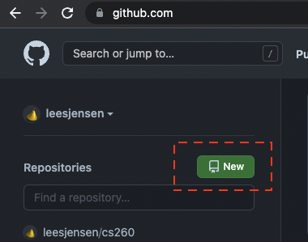
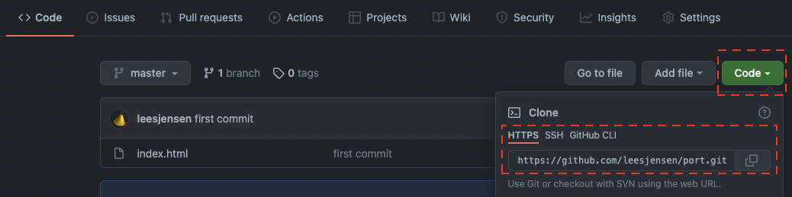

# Local Development Environment
In this tutorial, we will show you how to use a local development environment to create web content.  If you get confused or can't make something work, dont worry, you can keep using Cloud9.  But if you are ahead in the class and want an extra challenge, this tutorial will help you to take the next step

1) Select A [local editor](computingEnvironments.md), we suggest VSCode.  Install it on your laptop.
2) If you are on Windows, install [Git Bash] or use the [Windows Subsystem for Linux](https://learn.microsoft.com/en-us/windows/wsl/about).  This will provide you with a linux terminal.  If you are on a Apple Mac IOS computer or Linux, you can just use the terminal
3) Install [node and npm](https://nodejs.org/en/download/).  This will allow you to run a web server.
4) Go to GitHub and create a repository for this activity.



Call it "localDevelopment".
5) Get the repository URL from your newly created repository by pressing the code button and copying the URL.



6) On your laptop, or desktop computer, use your terminal to make a directory where you will store all of your source code. Give it a reasonable name like source. Change into that directory using your command shell.
```
mkdir source
cd source
```
7) Clone the repository you just created locally using the repository URL you just copied.
```
git clone https://github.com/<yourAccountHere>/<yourRepoHere>.git
```
This will create directory with the name of the repository you created. This directory will automatically be connected to your GitHub repository. The GitHub repository is what is know as an Origin repository. Change into that directory ```cd localDevelopment```. Do an ```ls -la``` and you will see the hidden .git directory which contains all of the revisions and configuration for the repository.
8) In your localDevelopment directory create a plain HTML file called index.html using VSCode or your favorite editor and add the following content.
```
<html>
Hello World
</html>
```
9) Install a web server using npm
```
npm install --global http-server
```
10) Run the web server from your localDevelopment directory using your terminal
```
http-server
```
You should be able to see your "index.html" page by enterng the following URL into another tab in your browser
```
http://localhost:8080/
```
11) Commit your changes by adding your newly created index.html file and executing the commit command along with a meaningful comment that describes what the change is. Then push your code to GitHub. 
```
git add index.html # Or git add . to add all files.
git commit -m "Initial localDevelopment page"
git push
```
The first time you commit you might be prompted to provide your user name and email address that will be associated with commits. To provide this information run the following. The --global flag means that it will be used for all commits from this computer.
```
git config --global user.email "you@example.com"
git config --global user.name "Your Name"
```
The first time you push you might be prompted for your GitHub user name and Personal Access Token that will authenticate you with GitHub. Your Personal Access Token can be used as your password to access your GitHub account.  Follow  these [instructions](https://docs.github.com/en/github/authenticating-to-github/keeping-your-account-and-data-secure/creating-a-personal-access-token). to get a token if you haven't already done that.
```
root@cs260:~/source/localDevelopment # git push
Username for 'https://github.com': yourGitHubUserName
Password for 'https://yourGitHubUserName@github.com': yourPersonalAccessToken
```

12) Go to GitHub and view your repository. It should show your newly added "index.html" content.

13) Most commercial web servers will host web content from the directory "/var/www/html".  To make this happen, you will need to change your caddy file to use this directory.  ```sudo nano /etc/caddy/Caddyfile``` and change "root * /usr/share/caddy" to "root * /var/www/html" and restart caddy 
```
sudo systemctl restart caddy
```
14) Now clone the repository on your production EC2 server and copy the files over to your website directory. You will only need to clone your repository once, but you will have to pull down changes, and copy the files to your website directory every time you want to get the latest files.  You can use the terminal in Cloud9, or you can use [SSH Keys](ssh.md) to connect to your server.

From your home directory (cd ~ if you are not already there) make a directory called something like source where you will store all of repositories that you clone using git. Move to your source directory ```cd ~/source```.

Use git clone just like was done to copy the source to your development machine
```
git clone https://github.com/<yourAccountHere>/localDevelopment.git
```
This should create a directory called localDevelopment on your production server in the location where you ran the clone command.

Copy your portfolio directory over to your website content directory. Make sure you use sudo if you are not the root user so that you have the correct rights.
```
sudo cp -r ~/source/localDevelopment /var/www/html/localDevelopment
```
Visit your production server in a browser to verify that you can see your new content.
https://yourdomain.click/localDevelopment

15) On your development (local) machine, make some kind of a change to your index.html file. Commit and push the changes to GiHub. This should automatically push your changes to your web server if you set up your CD process. Otherwise repeat these steps every time you want to publish a change to your production website.
- SSH into your production server or use the Cloud9 terminal
- Change to your repository source directory.
- Pull the latest content down using git pull.
- Copy the changed files from your repository directory (~/source/repo) to your website directory (/var/www/html).
Congratulations! This is your local development workflow! 


# Advanced Topics
If you are having no trouble with the other aspects of the class, you might want to explore some of these advanced topics.  Don't feel like any of these are essential to completing the class.  They are just optional topics that you may find interesting.
- [Computing Environments](computingEnvironments.md)
- [SSH Keys](ssh.md)
- [Mastering the Command Line](commandLine.md)
- [Virtual Private Servers](virtual.md)
- [Digital Ocean Servers](digocean.md)
- [Configuring a Domain](dns.md)
