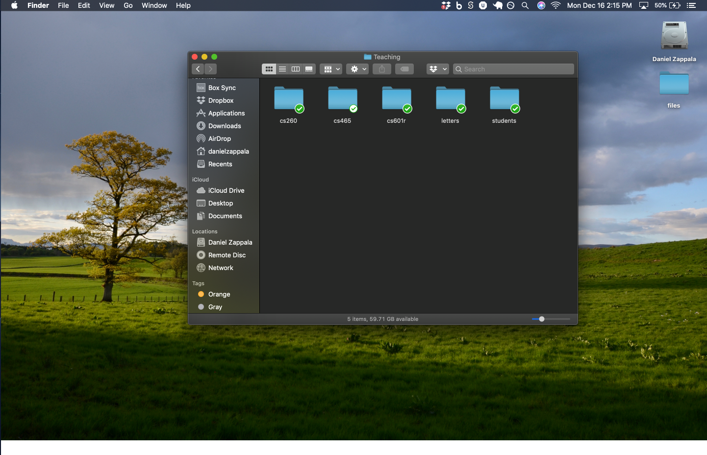
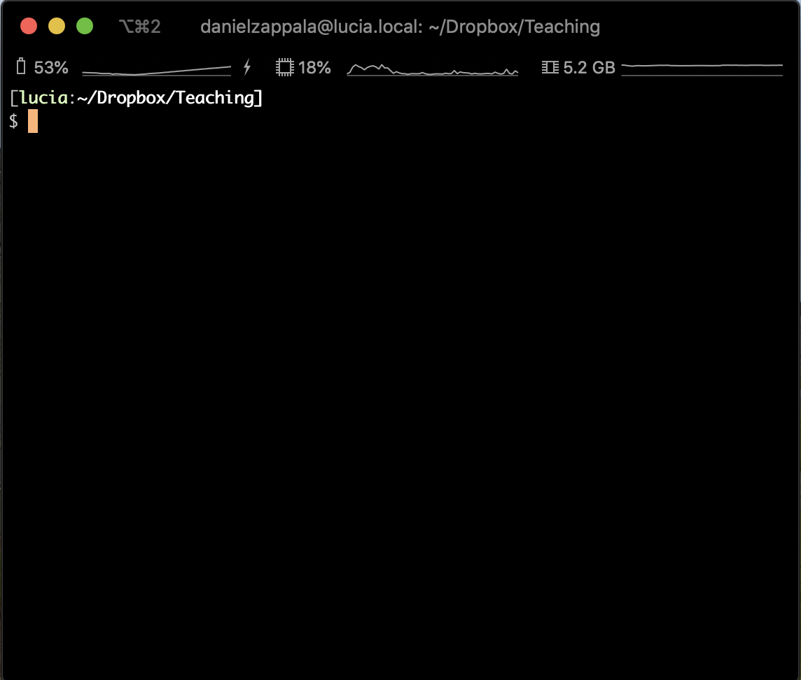

# Mastering the Command Line

You can use the command line to access files, run programs and configure a machine. 
The command line is the interface you use with a shell (e.g. bash), which is also called a terminal.

You are probably used to using a graphical interface to interact with your machine:

So if you instead have to use a command line, you may feel a little lost:

You will want to overcome any fear or uncertainty you have and gain some practice using the command line regularly. It's the only way you will have available to interact with a remote server, like your web server, for this class! I recommend using the command line even when you are on your laptop, so you can get used to it. You may even find that some things are faster this way.

To start learning your command line environment, use one of the following tutorials to improve your skills.

- Free
  - [Linux Tutorial](https://ryanstutorials.net/linuxtutorial/)
  - [Learning the Shell](http://linuxcommand.org/lc3_learning_the_shell.php) A great resource to show you the basics.
  - [Learn Enough Command Line to Be Dangerous](https://www.learnenough.com/command-line-tutorial/basics) free resource showing you the basics
- Fee required
  - A  [Codeacademy course](https://www.codecademy.com/courses/learn-the-command-line) (some free content, some available only with a $19.99 monthly subscription).
  - A very good book called [Learning Unix the Hard Way](https://learncodethehardway.org/unix/) (don't be put off by the title) and screencasts for $19.99.

You may find the following cheat sheet helpful: [Linux Command Line Cheat Sheet](https://www.cheatography.com/davechild/cheat-sheets/linux-command-line/pdf/)
